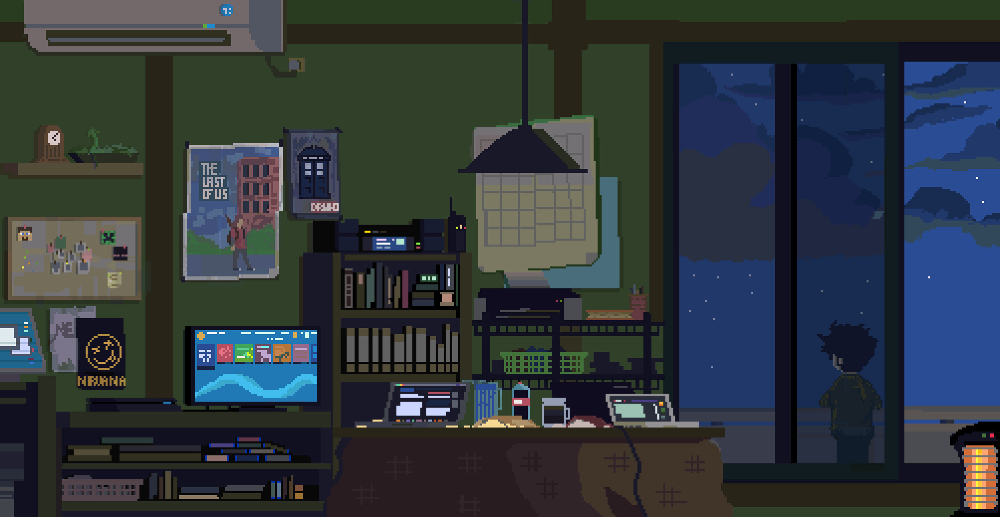

 

Ni Howdy, Jerwin here! I'm a student based in <strong>Manila, PH</strong>. I build things for the <strong>web</strong>. My code is held together by duct tape and prayers. pls send help. I spend more time customizing my VS Code than actually coding. If you see a bug, no you didn't. web: <a href="https://jrwnnnn.me" target="_blank">jrwnnnn.me</a> 

  
  
  
  
  
  

